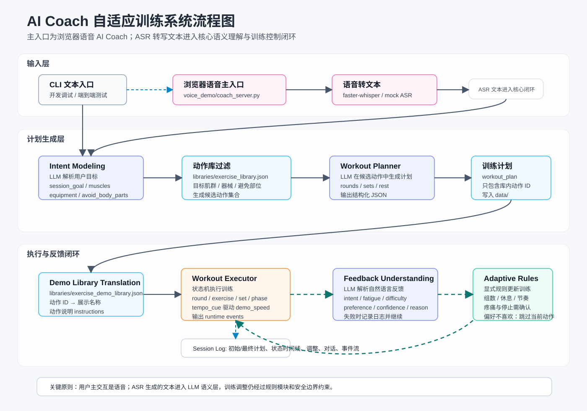

# AI Coach：基于生成式模型的自适应训练系统研究方案（汇报稿）

------

# Related Works

近年来，大语言模型（LLMs）在健康干预与运动指导中的应用逐渐受到关注。已有研究从不同角度验证了LLM在个性化运动建议中的潜力，同时也暴露出其在实际应用中的关键局限。

---

## 1. LLM在运动训练中的可行性

一系列研究已经从系统性分析与实验评估角度，验证了LLM作为“虚拟健身教练”的可行性。

JMIR Scoping Review（2026）系统性综述了LLM-based agents在身体活动与认知训练中的应用，指出：

- LLM能够生成个性化运动建议  
- 支持自然语言交互，提高用户参与度  
- 在健康干预中具有良好的应用前景  

与此同时，另一项JMIR研究（2024）对AI聊天机器人生成的训练建议进行了实证评估，从以下维度进行分析：

- 全面性（comprehensiveness）  
- 准确性（accuracy）  
- 可读性（readability）  

结果表明：

- LLM生成的训练建议在可读性和覆盖性方面表现良好  
- 能够满足非专业用户的基础训练需求  

---

👉 小结：

> 现有研究已经证明：  
> **LLM可以作为一种有效的个性化训练建议生成工具**

---

## 2. 现有方法的局限性

尽管LLM在训练建议生成方面表现出潜力，但现有研究普遍存在以下两个关键问题：

---

### 2.1 停留在“建议生成”，缺乏执行闭环

大多数LLM-based系统（如GPTCoach、PlanFitting、LLM-SPTRec等）主要关注：

- 如何生成训练计划  
- 如何通过对话优化建议  

但这些方法通常：

- 不参与训练执行过程  
- 不跟踪用户实时状态  
- 不具备训练过程中的动态调整能力  

因此，其本质仍然是：

> **Recommendation System（建议系统）而非 Training System（训练系统）**

---

### 2.2 依赖复杂状态建模的系统难以普及

另一类研究尝试通过精细状态建模弥补上述不足，例如：

- Digital Twin AI Fitness Coach  
- AI-Enhanced Fitness Coaching（IoT + CNN）

这些方法通过：

- 传感器数据  
- 可穿戴设备  
- 深度学习模型  

实现对用户状态的精确感知，并据此动态调整训练策略。

然而，这类方法存在明显局限：

- 依赖额外硬件设备  
- 部署成本高  
- 系统复杂度较高  
- 难以适用于居家训练场景  

---

👉 小结：

现有研究形成了两条路径：

| 路径         | 特点         | 局限           |
| ------------ | ------------ | -------------- |
| LLM生成系统  | 灵活、低成本 | 无执行、无反馈 |
| 状态感知系统 | 精确、自适应 | 成本高、复杂   |

---

## 3. 研究空缺

综合来看，现有方法缺乏一种系统能够同时满足：

- 不依赖复杂传感器或数字孪生  
- 支持训练执行过程  
- 能够根据用户状态进行动态调整  

换言之，当前研究缺失的是：

> **一个低成本、可交互、具备反馈闭环的训练系统框架**

---

## 4. 本研究的思路

针对上述问题，本研究提出：

> **基于自然语言反馈的闭环训练系统（LLM-driven Interactive Coaching Loop）**

其核心思想是：

- 使用自然语言反馈替代传感器数据  
- 引入训练执行阶段  
- 构建生成—执行—反馈—调整的闭环  

---

## 5. 小结

已有研究验证了LLM在训练建议生成中的有效性，但在训练执行与动态适应方面仍存在明显不足。

本研究通过引入自然语言反馈机制，在现有LLM方法与复杂状态建模方法之间提供了一种新的解决路径。

# 一、研究背景与研究问题

随着大众健康意识的提升，居家个人训练需求快速增长。然而，相较于在健身房由专业教练指导的训练场景，居家训练存在一个核心问题：

> **非专业用户具备训练目标，但缺乏训练计划设计能力。**

具体表现为：

- 无法根据训练目标（减脂、增肌、体能）设计合理训练结构
- 不清楚如何组合动作形成有效训练
- 难以根据自身状态动态调整训练强度
- 现有健身应用多提供固定课程，个性化与灵活性不足

与此同时，近年来生成式模型（LLM）展现出较强的知识表达与结构化生成能力，使其具备潜力承担“虚拟教练”的角色。

基于此，本研究关注如下核心问题：

------

## 研究问题

### RQ1

**生成式模型是否能够将用户自然语言目标转化为合理的结构化训练计划？**

### RQ2

**在训练过程中，是否可以利用自然语言反馈理解用户状态，并对训练策略进行动态调整？**

------

本研究将上述两个问题统一到一个完整系统中：

```
User Goal → Training Plan → Feedback → Adaptation
```

即：

> **构建一个由生成式模型驱动的、支持反馈闭环的自适应训练系统。**

------

# 二、本论文的研究思路

本研究提出一种**基于生成式模型的训练指导框架（AI Coach）**，用于帮助非专业用户完成从目标表达到训练执行的全过程。

系统的核心思想可以抽象为：

```
Goal-driven + Feedback-adaptive Training Loop
```

具体流程如下：

------

## 1. 目标驱动（Goal-driven Generation）

用户通过自然语言表达训练需求，例如：

```
今天想练腿，30分钟，强度不要太高
```

系统将其转换为结构化意图，并生成训练计划。

------

## 2. 结构化训练计划生成

基于用户目标，系统生成：

- 动作组合
- 组数
- 节奏
- 休息时间

并形成可执行训练结构。

------

## 3. 训练过程中的自然语言反馈

在训练过程中，用户可以通过自然语言表达状态，例如：

- “太累了”
- “快一点”
- “这个动作不喜欢”

------

## 4. 反馈驱动的训练调整

系统对反馈进行语义理解，并将其映射为结构化状态，进而对训练过程进行动态调整：

- 调整节奏
- 增减组数
- 修改休息时间
- 跳过当前动作剩余组数，后续可扩展为同类动作替换

------

因此，本研究关注的核心不是单次生成，而是：

> **一个持续交互的训练生成与调整过程（interactive training generation）**

------

# 三、反馈机制建模

本节对当前系统进行形式化描述。

------

## 3.1 状态表示（State Representation）

系统在训练过程中维护一个运行状态：

```
S_t = {
    current_exercise,
    current_set,
    phase,
    rest_multiplier,
    set_delta,
    tempo_cue,
    demo_speed
}
```

其中：

- `tempo_cue` 表示当前节奏策略
- `demo_speed` 为执行层参数
- `rest_multiplier` 与 `set_delta` 控制训练强度

------

## 3.2 用户反馈表示（Feedback Representation）

To better interpret users’ subjective feedback during training, we draw inspiration from Self-Determination Theory (SDT), particularly the dimensions of perceived competence and autonomy. Based on this, we design a set of structured feedback variables (e.g., fatigue, difficulty, and preference) and employ a large language model to map natural language feedback into these variables for subsequent rule-based training adjustment.

为了更好地接收和解释用户在训练中的反馈，受SDT理论中 competence 和 autonomy 维度的启发，系统设置了三个用户状态变量：
- fatigue
- difficulty
- preference

当前实现中，反馈回路采用“两段式”机制：LLM 负责理解用户自然语言反馈，并输出结构化反馈信号；训练计划如何调整则由显式规则模块决定。也就是说，LLM 不直接生成训练调整动作，而是先将反馈标准化为可计算表示：

```
F_t = {
    intent,
    fatigue_level,
    difficulty_level,
    preference,
    confidence,
    reason
}
```

其中 `intent` 的候选类型包括：

- `stop`
- `pain`
- `fatigue`
- `pace_up`
- `pace_down`
- `preference_dislike`
- `preference_like`
- `neutral`
- `unknown`

例如：

```
“太累了” → intent = fatigue, fatigue_level = high, difficulty_level = hard
“快一点” → intent = pace_up
“这个动作不喜欢” → intent = preference_dislike, preference = dislike
```

------

## 3.3 策略更新机制（Policy Update）

当前系统采用**LLM 理解 + 规则驱动策略更新**的机制：

```
S_{t+1} = f(S_t, F_t)
```

其中：

- `F_t` 是 LLM 从用户自然语言中解析出的结构化反馈信号
- `f` 为一组确定性规则
- 系统根据 `intent`、`fatigue_level`、`difficulty_level` 和 `preference` 更新训练参数

典型规则包括：

| 结构化反馈 | 当前规则调整 |
| ---------- | ------------ |
| `intent = stop` | 不立即停止，先触发二次确认 |
| `intent = pain` | 自动降低强度：减少后续组数、增加休息、放慢节奏，并触发继续/停止确认 |
| `intent = pace_up` | 缩短后续休息时间，节奏提示调整为 `faster` |
| `intent = pace_down` | 延长后续休息时间，节奏提示调整为 `slower` |
| `intent = preference_dislike` | 跳过当前动作剩余组数，进入后续训练 |
| `fatigue_level = high` 或 `difficulty_level = hard` | 后续动作减少 1 组，休息时间增加，节奏放慢 |
| `fatigue_level = medium` | 适度增加后续休息时间 |
| `fatigue_level = low` 且 `difficulty_level = easy` | 适度缩短休息时间，节奏加快 |

为保证调整稳定性，系统还设置了边界约束：组数、休息时间、累计组数调整量和休息倍率都限制在预设范围内，避免一次反馈导致训练结构发生过大变化。

------

## 3.4 安全控制机制

对于关键指令（如停止或疼痛），系统引入确认逻辑：

```
stop / pain → confirmation → termination or adjustment
```

用于避免误触发。

------

## 3.5 小结

当前系统实现的是一种：

> **基于自然语言反馈解析 + 显式规则更新的训练控制机制**

其特点为：

- 可解释性强
- 实现稳定
- 易于分析与扩展

------

# 四、系统架构



本系统基于当前代码实现，构建了一个由生成式模型驱动的**状态化训练执行系统（stateful training system）**。整体架构不仅包含模块划分，还强调**模块之间的数据流与控制逻辑**。

当前系统既支持命令行文本交互，也包含一个浏览器语音交互原型。语音层负责把用户语音转换为文本反馈，核心训练闭环仍然由意图建模、计划生成、执行器、反馈理解和规则调整共同完成。

系统可进一步细化为如下核心子模块：

```
User / Browser Voice Interface
 ↓
Intent Modeling
 ↓
Workout Planner
 ↓
Exercise Library Filtering
 ↓
Exercise Translator / Demo Library
 ↓
Workout Executor (State Machine)
 ↓
Feedback Understanding
 ↓
Adaptive Adjustment
```

------

## 4.1 用户意图建模（Intent Modeling）

该模块负责将用户自然语言输入转化为结构化训练意图，是系统的入口。

------

### （1）输入

用户输入为自由表达的自然语言，例如：

```
今天想练腿，20分钟，强度不要太大
```

------

### （2）处理方式

通过 LLM（当前为轻量模型）结合提示词进行语义解析，将输入映射为标准化 JSON：

```
{
  "session_goal": "general_fitness",
  "target_muscles": ["legs"],
  "duration_minutes": 20,
  "intensity_preference": "low",
  "experience_level": "unknown",
  "equipment_available": ["none"],
  "avoid_body_parts": []
}
```

------

### （3）设计特点

- 使用结构化输出，避免下游模块解析困难
- 对缺失信息进行默认填充（如默认30分钟）
- 显式提取可用器械与需避免部位，用于后续动作库过滤
- 保证输入稳定性，为后续生成模块提供可靠条件

------

### （4）作用

该模块完成：

> **自然语言 → 结构化训练目标**

是系统中“语义理解层”的第一步。

------

## 4.2 训练计划生成（Workout Planner）

该模块负责根据结构化意图生成训练计划，是系统的“策略生成核心”。

------

### （1）输入

来自 Intent Modeling：

```
session_goal
target_muscles
duration_minutes
intensity_preference
equipment_available
avoid_body_parts
```

------

### （2）处理流程

系统采用：

> **结构约束 + LLM生成（structure-guided generation）**

#### Step 1：动作库过滤

当前系统使用 `libraries/exercise_library.json` 作为训练计划动作库。该库中的每个动作包含：

```
name
target_muscles
equipment
avg_set_time
```

Planner 会先根据用户意图过滤候选动作：

- 根据 `equipment_available` 保留用户可执行的动作
- 根据 `avoid_body_parts` 排除涉及需避免部位的动作
- 根据 `target_muscles` 优先选择目标肌群相关动作

过滤后的候选动作才会被放入 LLM prompt 中，从而约束模型只能在动作库范围内生成训练计划。

------

#### Step 2：确定训练结构

根据目标类型，选择模板：

```
Fat loss → circuit training
Strength → sets-based training
General fitness → mixed structure
```

------

#### Step 3：估计训练规模

例如：

```
total_time → 推导 exercises 数量
rounds → 根据目标设定
```

------

#### Step 4：生成结构化计划

输出类似：

```
{
  "rounds": 2,
  "rest_between_rounds": 30,
  "exercises": [
    {
      "exercise": "bodyweight_squat",
      "total_sets": 3,
      "avg_set_time": 40,
      "rest_seconds": 30
    }
  ]
}
```

------

### （3）设计特点

- 控制LLM生成范围，避免不合理结构
- 使用模板减少随机性
- 使用动作库约束候选动作，降低模型生成未知动作的概率
- 输出为结构化计划，便于执行器处理

------

### （4）作用

完成：

> **训练目标 → 结构化训练计划**

------

## 4.3 动作映射与翻译（Exercise Translator）

该模块将 Planner 输出的动作 ID 转换为执行阶段可展示的动作信息。当前实现中，系统明确区分了两个动作库：

- `libraries/exercise_library.json`：训练计划动作库，用于 Planner 约束动作选择和动作过滤。
- `libraries/exercise_demo_library.json`：动作演示说明库，用于 Executor 展示动作名称和文字说明。

这种分层避免把“计划生成所需的动作属性”和“执行展示所需的演示说明”混在同一个结构中。

------

### （1）输入

来自 Planner：

```
{
  "exercise": "bodyweight_squat",
  "avg_set_time": 40,
  "total_sets": 3,
  "rest_seconds": 30
}
```

------

### （2）处理方式

执行器通过 `translate_plan_for_demo` 将动作 ID 映射到演示说明库：

```
exercise id → display name → instructions
```

例如：

```
{
  "exercise_name": "Bodyweight Squat",
  "instructions": [
    "Stand with feet shoulder-width apart",
    "Push hips back",
    "Lower until thighs parallel",
    "Drive through heels to stand"
  ]
}
```

需要注意的是，`demo_speed` 当前不是静态动作库字段，而是训练执行时的运行时参数。系统通过 `tempo_cue`（如 `normal`、`slower`、`faster`）间接驱动后续演示节奏或语音节奏控制。

------

### （3）设计特点

- 避免 LLM 生成未知动作
- 提供标准化执行接口
- 将动作计划属性与动作演示说明解耦
- 支持后续扩展（视频 / avatar）

------

### （4）作用

完成：

> **抽象动作 → 可执行动作**

------

## 4.4 训练执行器（Workout Executor）

这是系统的核心控制模块，实现为一个**状态机（state machine）**。

------

### （1）核心职责

- 控制训练流程
- 管理时间与阶段
- 接收用户反馈
- 调用调整策略
- 驱动训练推进
- 输出运行时事件并导出训练日志

------

### （2）内部状态（SessionState）

系统维护一个会话级状态：

```
current_round
current_exercise
current_set
phase (work / rest)
seconds_remaining
```

以及动态调节参数：

```
rest_multiplier
set_delta
tempo_cue
demo_speed
user_condition
```

------

### （3）执行流程

```
start session
 → for each round
   → for each exercise
     → for each set
       → work phase
       → rest phase
```

每一步均：

- 检查反馈
- 更新状态
- 输出提示

------

### （4）设计特点

- 完全可控（非LLM驱动）
- 支持实时交互
- 可记录全过程日志，包括初始计划、最终计划、用户状态时间线、调整记录、对话记录、反馈理解失败记录和运行时事件流

------

### （5）作用

实现：

> **训练计划 → 实际执行过程**

------

## 4.5 反馈理解模块（Feedback Understanding）

该模块负责将用户反馈转换为结构化信号，是反馈闭环中“语义理解”的部分。当前实现中，该模块使用本地 Ollama 大语言模型对用户反馈进行解析，但不直接决定训练如何调整；具体调整由后续规则模块完成。

------

### （1）输入

用户自然语言：

```
太累了
快一点
停一下
```

------

### （2）处理方式

通过 LLM + prompt 解析为结构化 JSON：

```
{
  "intent": "fatigue",
  "fatigue_level": "high",
  "difficulty_level": "hard",
  "preference": "neutral",
  "confidence": 0.86,
  "reason": "用户表达当前训练过累，需要降低强度"
}
```

当前允许的 `intent` 类型包括：

```
stop
pain
fatigue
pace_up
pace_down
preference_dislike
preference_like
neutral
unknown
```

模块会同时传入当前训练状态快照，例如当前阶段、轮次、动作、组次、已有疲劳状态、节奏提示、休息倍率和组数调整量，使 LLM 能结合上下文理解用户反馈。

------

### （3）关键能力

- 识别反馈类型（停止 / 疼痛 / 疲劳 / 加快 / 放慢 / 偏好）
- 提取训练相关语义（难度 / 疲劳 / 偏好 / 节奏）
- 提供置信度（confidence）
- 输出解释字段（reason），便于后续日志分析
- 在 LLM 输出不规范时进行 JSON 提取、字段归一化和边界校验

------

### （4）安全逻辑

对于敏感指令：

```
stop / pain → 二次确认
```

具体来说：

- `stop`：系统不会直接结束训练，而是询问用户是否确认停止。
- `pain`：系统会先自动降低强度，并询问用户继续还是停止。
- 如果反馈理解失败，系统不会硬性调整训练，而是记录失败日志并继续监控。

------

### （5）作用

完成：

> **自然语言 → LLM 语义理解 → 可计算反馈信号 → 规则调整输入**

------

## 4.6 自适应调整模块（Adaptive Adjustment）

该模块根据反馈更新训练策略，是系统的“控制逻辑层”。

------

### （1）输入

```
当前状态 S_t
反馈 F_t
```

------

### （2）调整方式（当前实现）

采用规则映射：

```
intent = pain → set_delta - 1, rest_multiplier × 1.25, tempo_cue = slower, confirmation
intent = stop → confirmation
intent = pace_up → rest_multiplier × 0.85, tempo_cue = faster
intent = pace_down → rest_multiplier × 1.15, tempo_cue = slower
intent = preference_dislike → skip remaining sets of current exercise
fatigue_level = high or difficulty_level = hard → set_delta - 1, rest_multiplier × 1.20, tempo_cue = slower
fatigue_level = medium → rest_multiplier × 1.10
fatigue_level = low and difficulty_level = easy → rest_multiplier × 0.90, tempo_cue = faster
```

因此，当前系统不是由 LLM 直接输出训练动作，而是由 LLM 产生结构化反馈 `F_t`，再由规则模块将其转换为可执行调整。

------

### （3）调整对象

- 组数（set）
- 节奏（tempo）
- 休息时间（rest）
- 当前动作剩余组数

当前代码中已经保留了同类动作替换的候选查找能力，但对 `preference_dislike` 的实际执行策略是跳过当前动作剩余组数，而不是直接替换动作。这一设计更保守，避免在训练过程中突然引入用户尚未预览的新动作。

------

### （4）边界约束

为避免一次反馈导致训练计划发生过大变化，系统对关键参数设置了上下限：

- 每个动作组数限制在 1 到 8 组
- 休息时间限制在 5 到 180 秒
- 累计组数调整量限制在 -3 到 3
- 休息倍率限制在 0.5 到 2.0

------

### （5）输出

更新状态：

```
S_{t+1}
```

供执行器使用。

------

### （6）设计特点

- 可解释
- 稳定
- 易于扩展
- 保守处理停止、疼痛和动作偏好等敏感反馈

------

## 4.7 浏览器语音交互模块（Voice Interaction Prototype）

当前项目新增了一个本地浏览器语音交互原型，用于将训练反馈从文本输入扩展到语音输入。该模块位于 `voice_demo/`，包含两个入口：

- `voice_demo/server.py`：独立语音链路 Demo，用于测试浏览器麦克风、WebSocket 音频流、VAD 分段、本地 ASR 和浏览器 TTS。
- `voice_demo/coach_server.py`：浏览器版 AI Coach，将首句语音路由到意图建模与计划生成，后续语音路由到训练反馈循环。

------

### （1）处理链路

```
Browser microphone
 ↓
WebSocket PCM streaming
 ↓
VAD segmentation
 ↓
faster-whisper ASR
 ↓
transcript
 ↓
AI Coach core loop
 ↓
browser speechSynthesis TTS
```

该模块并不改变核心训练控制逻辑。它主要提供一个新的输入/输出界面：语音先被转换成文本，再进入原有的 `Intent Modeling` 或 `Feedback Understanding` 模块。

------

### （2）设计特点

- 本地运行，不依赖云端语音识别服务
- 支持 mock ASR，用于在不加载 Whisper 模型时测试浏览器和 VAD 链路
- 使用浏览器 TTS 播放简短教练提示
- 语音模型文件存放在 `voice_demo/models/`，不进入 Git 仓库

------

### （3）作用

完成：

> **语音反馈 → 文本反馈 → 现有 AI Coach 闭环**

------

## 4.8 模块间数据流总结

整个系统的数据流可以总结为：

```
Text Input / Voice Input
 ↓
Voice ASR (optional)
 ↓
Intent → Structured Goal
 ↓
Exercise Library Filtering
 ↓
Planner → Structured Plan
 ↓
Demo Library Translation → Executable Plan
 ↓
Executor (State Machine)
 ↓ ← ← ← ← ← ← ← ← ← ← ← ← ← ← ← ←
Feedback → Structured Signal      ↑
 ↓                                ↑ Loop
Adjustment → Updated State        ↑
 ↓ → → → → → → → → → → → → → → → → 
Session End
```

------

## 4.9 小结

相比简单“LLM生成系统”，本系统具有三个关键结构特征：

------

### 1️⃣ 分层设计

- 语义层（LLM）
- 控制层（规则）
- 执行层（状态机）

------

### 2️⃣ 状态驱动

系统不是一次性生成，而是：

```
stateful + interactive
```

------

### 3️⃣ 可控性

- LLM只负责理解与生成
- 决策逻辑由系统控制

------

👉 这使系统具备：

> **可分析、可扩展、可研究的结构基础**

------

# 五、实验设计

本研究采用对比实验验证系统效果。

------

## 5.1 实验条件

### A：固定课程（Baseline）

- 无个性化
- 无反馈机制
- 事先生成的无反馈系统（已有的其他论文思路例如：**LLM-SPTRec**、**PlanFitting**、**GPTCoach**）

------

### B：AI Coach系统（本文方法）

- 用户提供自然语言反馈
- LLM解析语义
- 系统动态调整训练

------

## 5.2 评估指标

- SUS（可用性）
- UEQ（用户体验）
- PANAS（情绪）
- 训练完成率
- 调整次数
- 用户满意度
- 偏好度
- 反馈意见文本

------

# 六、小结

本研究构建了一个完整的 AI Coach 原型系统，实现了：

- 从自然语言目标到训练计划的生成
- 从自然语言反馈到训练调整的闭环

当前系统的核心特点是：

> **基于自然语言理解的自适应训练系统**

# 参考文献

- **LLM-SPTRec框架**（Nature 2026）：基于知识图谱增强的大语言模型用于智能运动训练计划生成 **Knowledge-grounded large language model for personalized sports training plan generation** https://www.nature.com/articles/s41598-026-37075-z#Sec5
- **PlanFitting系统**（2023-2024）：基于LLM的对话式智能体，用于创建和优化个性化运动计划 **PlanFitting: Personalized Exercise Planning with Large Language Model-driven Conversational Agent** https://dl.acm.org/doi/10.1145/3719160.3736607
- **Digital Twin AI Fitness Coach**：基于多智能体架构的数字孪生AI健身教练系统 **Digital Twin AI Fitness Coach: An Intelligent Multi-Agent System for Personalized Exercise Guidance** https://dl.acm.org/doi/10.1145/3728485.3759171
- **GPTCoach: Towards LLM-Based Physical Activity Coaching** https://dl.acm.org/doi/10.1145/3706598.3713819 基于LLM的聊天机器人通过访谈和多轮交流提出健身计划
- **JMIR的****研究统计分析**：LLM-based AI教练在个性化运动和健康干预中的应用 **Large Language Model–Based Agents for Physical Activity and Cognitive Training: Scoping Review** https://ai.jmir.org/2026/1/e80123#ref39
- **Comprehensiveness, Accuracy, and Readability of Exercise Recommendations Provided by an AI-Based Chatbot: Mixed Methods Study** https://mededu.jmir.org/2024/1/e51308 评估由新型AI聊天机器人生成的个性化锻炼建议的全面性、准确性和可读性。
- **AI-Enhanced Fitness Coaching**：通过CNN处理可穿戴设备和传感器数据识别状态，训练过程中动态调整计划 **AI-Enhanced Fitness Coaching: Personalized Workout Plans with Integrated IoT Data and Deep Learning** https://ieeexplore.ieee.org/document/11383556
- **Using artificial intelligence for exercise prescription in personalised health promotion: A critical evaluation of OpenAI’s GPT-4 model** https://pmc.ncbi.nlm.nih.gov/articles/PMC10955739/ 基于GPT4的30天定制训练计划
